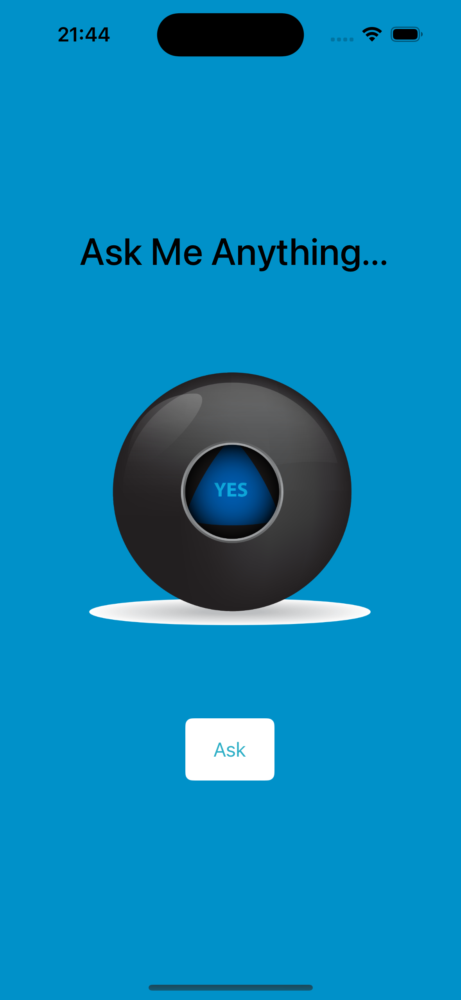

# Magic 8 Ball 🎱

## My Goal 🎯

The objective is to practice the core programming concepts that will form the foundation of most of the apps I’ll build in the future.

## What I created ⚙️

I'am going to make a Magic 8 Ball app. You can ask the app to make all your hard decisions! With this app in my pocket, I will always have an answer to life’s many conundrums!

## What I learned 📝

* How to clone an existing Xcode project from GitHub.
* Create an app with behaviour and functionality.
* Create links between the Interface Builder files and code using IBActions and IBOutlets.
* Get familiar with the Xcode code editor.
  * Learn to use comments to annotate code.
* Understand and use Swift constants and variables.
* Understand and use collection types such as Swift arrays.
* Test and debug your app with the Xcode console.
* Learn about randomisation and how to generate random numbers in Swift.

>No Retreat, No Surrender!!!

